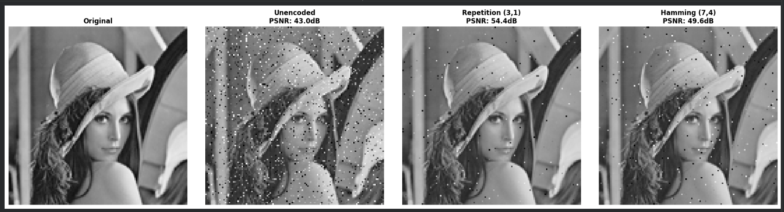

# Error-Control-Coding-BSC-Simulation

> **Information Theory & Coding** | Grayscale Image Transmission over a Noisy Channel

---

## Overview

This project simulates transmitting a grayscale image over a **Binary Symmetric Channel (BSC)** and compares how two **Linear Block Codes (LBC)** recover the image from noise:

| Scheme | Code Rate | Error Correction Method |
|---|---|---|
| Unencoded | 1 | None |
| Repetition (3,1) | 1/3 | Majority Logic Decoding |
| Hamming (7,4) | 4/7 | Syndrome-based Single-bit Correction |

**Quality Metric:** PSNR (Peak Signal-to-Noise Ratio) in dB — higher is better.

---

## Results (p = 0.03)

| Transmission Scheme | PSNR |
|---|---|
| Unencoded | ~43.2 dB |
| Hamming (7,4) | ~50.1 dB |
| Repetition (3,1) | ~56.0 dB |

> Repetition achieves higher PSNR due to greater redundancy (R = 1/3), while Hamming (7,4) offers a better trade-off between bandwidth efficiency (R = 4/7) and error recovery.

---

## How to Run

### In Google Colab
```python
# Step 1: Download the test image
!wget https://upload.wikimedia.org/wikipedia/en/7/7d/Lenna_%28test_image%29.png -O test.png

# Step 2: Run the simulation
run_advanced_simulation('test.png', p=0.03)
```

### Locally
```bash
pip install numpy matplotlib pillow
python error_control_coding_bsc_simulation.py
```

---

## Key Concepts

- **BSC (Binary Symmetric Channel):** Each bit independently flips with probability `p`.
- **Repetition (3,1):** Every bit is transmitted 3 times; receiver applies majority vote to recover it.
- **Hamming (7,4):** Uses a Generator Matrix `G` (4×7) to encode 4 data bits into 7-bit codewords, and a Parity Check Matrix `H` (3×7) to compute syndromes and correct single-bit errors.
- **PSNR:** Measures image recovery quality — higher dB = closer to the original.

---

## File Structure

```
Error-Control-Coding-BSC-Simulation/
├── error_control_coding_bsc_simulation.py   # Main simulation code
├── README.md                                # This file
└── test.png                                 # Lenna test image (download via wget)
```


